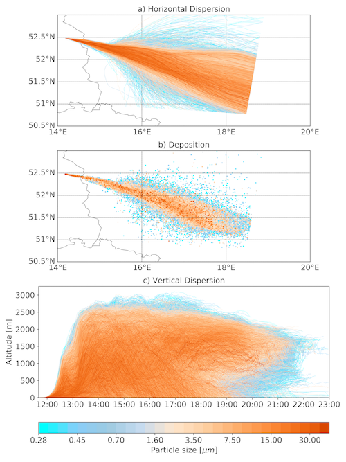

# Trajectory plot
## Post processing and visualization of trajectory data.

This Repository is about the processing and visualisation of a huge set of trajectory data.

### Method
The trajectories are read from multiple NetCDF files and gather into a NumPy array.
Unnecessary information is cropped, e.g. dead ends. Further details are explained in the [Notebook](traj-plot.ipynb).  

Then 4x1 Panel plot is drawn.
1. a horizontal map of the trajectories  
2. a deposition map
3. vertical dispersion of the trajectories as a time series
4. a colour bar

To plot the huge amount of data I use a [fast-trajectory-plot](https://github.com/mttfst/fast-trajectory-plot) method, which allows to draw >100k trajectories in a reasonable time.

### Sample data
You can find a sample data set to run this code [here](https://doi.org/10.5281/zenodo.3965683).

### Application

I use trajectory data from the Lagrangian particle dispersion model *[Itpas](https://zenodo.org/record/3932248)* for this project.

This software is part of the *Itpas* post-processing. However, the used methods can be adapted to projects with similar problems.  

<!-- Details on the particle model and its application can be found (later) at Faust et al. (in Prep.) -->

### Requirements
The code is written in python3 as Jupyter Notebook. A copy of the code as python script ([traj-plot.py](traj-plot.py)) is included but will be updated only for the release-versions.

Following packages are used:
- numpy
- matplotlib
- basemap
- NetCDF4
- time
- datetime
- os
- sys

### Citation
Please cite this software as suggested by Zenodo on the right.
